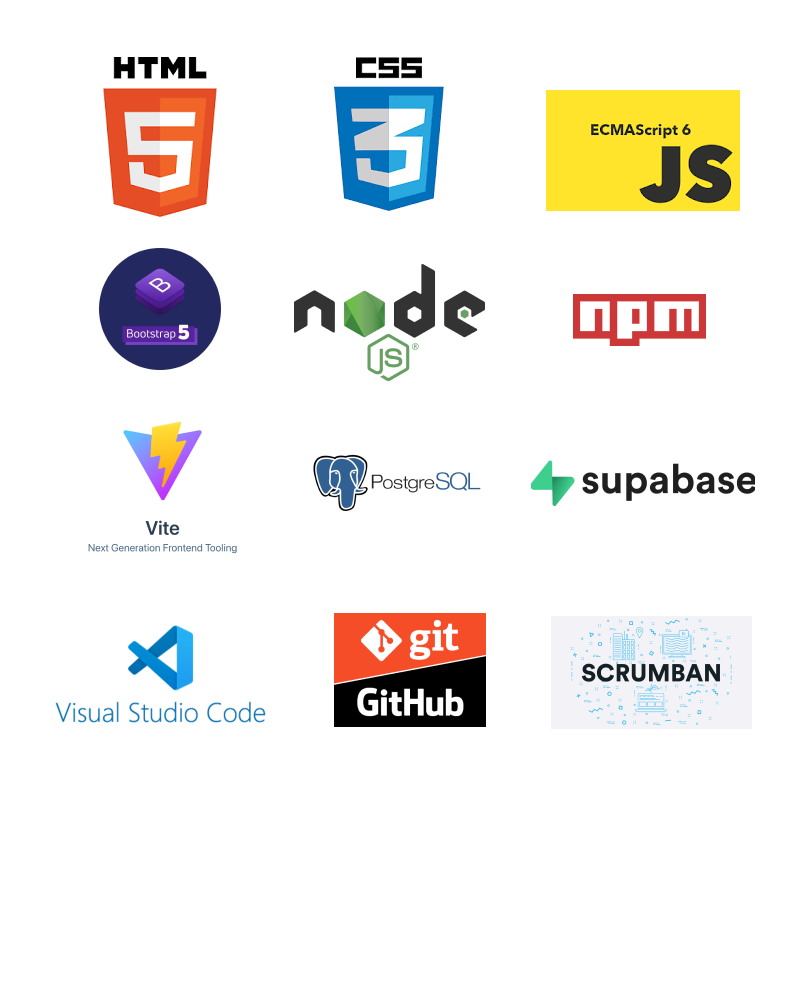
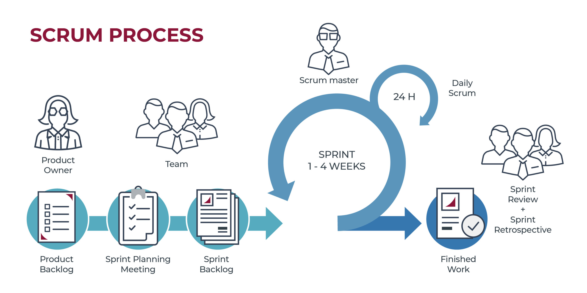

# Definiendo el proyecto 'Vanilla Games'

## Escenario del proyecto

Vanilla Games S.L. es una empresa de desarrollo de minijuegos para navegadores web, creados con vanillaJS, es decir, desarrollados exclusivamente con Javascript como lenguaje de programación (sin frameworks).

En esta empresa trabajan 10 desarrolladores y, habitualmente, suelen tener a tres alumnos/as en prácticas, de los cuales, al menos uno, tendrá muchas posibilidades de formar parte del equipo de desarrollo al acabar su etapa de formación.

El método de trabajo que se utiliza en dicha empresa consiste en proponer a cada uno de los miembros del equipo el desarrollo de un minijuego que, al acabar, deberán compartir con el resto de sus compañeros. Estos, a su vez, deben comentar y valorar cada una de las propuestas. Finalmente, en la empresa hay un equipo responsable de seleccionar aquellas propuestas que muestran un mayor potencial, para ser desarrolladas de manera definitiva por todo el equipo de trabajo, con el fin de crear una aplicación para su posterior comercialización.

Hasta la fecha, para el proceso de publicación de proyectos, comentarios y valoración utilizaban algunas herramientas ofimáticas, tipo hoja de cálculo de google. Actualmente pretenden crear una aplicación web tipo intranet para llevar a cabo este propósito.

Como alumno en prácticas, tu trabajo consiste en crear una aplicación web que permitirá a los desarrolladores de Vanilla Games, publicar sus propuestas de minijuegos, de manera que el resto de compañeros podrá hacer comentarios y emitir una valoración de cada proyecto publicado en esta plataforma.

## Requisitos del proyecto y casos de uso general

Los casos de uso son una técnica de modelado utilizada en el desarrollo de software para describir las interacciones entre un sistema y sus usuarios. En términos simples, los casos de uso describen cómo los usuarios interactúan con un sistema y qué resultados esperan obtener de él.

## Casos de uso general

Esta aplicación web debe permitir a un usuario registrarse (con su nombre, apellidos, email y contraseña) y posteriormente iniciar y cerrar sesión. Un usuario registrado debe poder ver un listado de proyectos publicados por los desarrolladores. También podrá editar su perfil y subir una imagen de tipo avatar.

Si el usuario registrado tiene el perfil de ‘desarrollador’ , además, debe poder publicar proyectos con información del tipo: nombre de proyecto, una descripción, una imagen representativa y dos enlaces, el del proyecto desplegado en un servidor de pruebas y el del repositorio del código correspondiente, el estado del proyecto, etc. También debe poder eliminar o editar sus proyectos.

Por otro lado, el perfil desarrollador debería poder realizar comentarios de cada uno de los proyectos publicados y añadir una valoración en forma de estrellas.

Finalmente, habrá un administrador que podrá adminstrar el perfil de cada uno de los usuarios registrados en la plataforma (editar, borrar, etc) así como modificar el rol de cada uno de estos. También tendrá control total sobre los comentarios y valoraciones.

## Fases de desarrollo

Necesitamos organizarnos un poco. Vamos a planificar como vamos a llevar a cabo las diferentes fases para cumplir con nuestros objetivos:

Definición del proyecto y requisitos básicos: En primer lugar debemos tener muy claro qué se espera de nuestra aplicación, por lo que anotaremos cada funcionalidad teniendo en cuanta los diferentes actores (roles de acceso). Esto es lo hemos hecho en el apartado anterior.
Definición de las versiones: Una vez conocemos los requisitos del proyecto, dividiremos el trabajo en diferentes versiones, de manera que todas ellas serán operativas, aunque cada una ampliando las funcionalidades.
Planificación del proyecto: Basandonos en la metodología Agile devidiremos todo el proceso en diferentes historias/tareas (para cada una de las versiones definidas) que: agruparemos, temporizaremos y representaremos mediante diagramas.
Diseño de la interficie: Basandonos en el diseño centrado en el usuario (DCU):
Realizaremos un Benchmarking (para copiarnos de la competencia)
Crearemos un modelo de usuarios
Diseñaremos los prototipos de bajo nivel(bocetos, wireframes)
Diseñaremos el mockup (prototipo de alto nivel) junto a la guía de estilos (usaremos la aplicación Figma)
Haremos pruebas de usabilidad y rediseñaremos los prototipos.
Programación del frontend (html/css/js):Maquetaremos los prototipos (html/css) y diseñaremos la lógica de validación de cliente
Programación del backend: Utilizaremos un backend como servicio (SUPABASE) para:
Crear las bases de datos
Diseñar consultas sql y funciones postgres
Programaremos un ORM en javascript para el mapping de la bd.
Integración de frontend y backend en la aplicación:
Programaremos la SPA a partir de los prototipos
Programaremos la lógica de acceso a la bd empleando el ORM
Programaremos el resto de funcionalidades (sesiones y roles de acceso, etc)
Analisis usabilidad II: Haremos pruebas de usabilidad (test de usuarios) y solucionaremos los posibles conflictos detectados.
Testing y despliegue en producción:
Diseñaremos un sistema de testing para crear tests unitarios
Configuraremos un entorno DevOps para trabajar con Integración continua y despliegue continuo (CI/CD)
Desplegaremos en producción cada una de las versiones.

# Stack tecnológico

# Metodología Agile. Conceptos

## ¿Qué son las metodología Agile?

Agile es un enfoque de desarrollo de proyectos que se basa en la flexibilidad, la colaboración y la entrega incremental de software.

Este enfoque se utiliza para planificar y gestionar proyectos de manera que puedan adaptarse a los cambios en los requisitos del cliente y a las condiciones cambiantes del mercado.

## Terminología

Os explico la terminología 'Agile' y cómo se usa en la planificación del desarrollo de proyectos en sus diferentes versiones:

User Stories (Historias de Usuario): Las historias de usuario son descripciones breves y centradas en el usuario de las funcionalidades o características que se deben desarrollar. Están escritas en lenguaje natural y se utilizan para representar los requisitos desde la perspectiva del usuario.

Product Backlog (Lista de Producto): Es una lista priorizada de todas las historias de usuario y características que se desean incluir en el producto. El backlog se actualiza y reordena de forma continua a medida que se obtiene más información o cambian las prioridades.

Sprints: Un sprint es un período de tiempo fijo y corto (generalmente de 2 a 4 semanas) durante el cual se trabaja en un conjunto específico de historias de usuario del backlog. Los sprints permiten una entrega incremental y regular de funcionalidades.

Sprint Planning (Planificación de Sprint): En la planificación de sprint, el equipo selecciona las historias de usuario del backlog que se abordarán en el próximo sprint. Esto implica estimar la complejidad y el esfuerzo necesario para cada historia y comprometerse con un conjunto de trabajo para el sprint.

Daily Standup (Reunión Diaria): También conocida como la reunión de scrum, es una breve reunión diaria en la que el equipo se pone al día sobre lo que ha hecho, lo que planea hacer y si hay obstáculos en su camino. Esto fomenta la comunicación y la colaboración.

Sprint Review (Revisión de Sprint): Al final de cada sprint, se realiza una revisión para demostrar las funcionalidades desarrolladas y obtener retroalimentación del cliente o del equipo de stakeholders. Esto ayuda a ajustar las prioridades del backlog.

Sprint Retrospective (Retrospectiva de Sprint): Después de la revisión de sprint, el equipo realiza una retrospectiva para analizar lo que funcionó bien y lo que se puede mejorar en el proceso. Esto facilita la adaptación continua y la mejora.

Burndown Chart (Gráfico de Burn-Down): Es una representación visual del trabajo restante en el sprint. Muestra cómo el equipo está progresando hacia la finalización de las tareas planificadas para el sprint.

Velocity (Velocidad): La velocidad es una medida de la cantidad de trabajo que un equipo puede completar en un sprint. Se utiliza para estimar cuántas historias de usuario se pueden abordar en futuros sprints.

En cuanto a las diferentes versiones de Agile, existen varios marcos y metodologías, como Scrum, Kanban, Lean, eXtreme Programming (XP) y más. Cada uno tiene sus propias prácticas y enfoques, pero todos comparten el valor fundamental de la flexibilidad y la adaptación continua en el desarrollo de software.

La elección de la metodología Agile adecuada depende de las necesidades específicas del proyecto y del equipo de desarrollo. Cada uno de estos enfoques se adapta a diferentes contextos y preferencias organizativas.

## SCRUM

Casos de uso general Esta aplicación web debe permitir a un usuario registrarse (con su nombre, apellidos, email y contraseña) y posteriormente iniciar y cerrar sesión. Un usuario registrado debe poder ver un listado de proyectos publicados por los desarrolladores. También podrá editar su perfil y subir una imagen de tipo avatar.

Si el usuario registrado tiene el perfil de ‘desarrollador’ , además, debe poder publicar proyectos con información del tipo: nombre de proyecto, una descripción, una imagen representativa y dos enlaces, el del proyecto desplegado en un servidor de pruebas y el del repositorio del código correspondiente, el estado del proyecto, etc. También debe poder eliminar o editar sus proyectos.

Por otro lado, el perfil desarrollador debería poder realizar comentarios de cada uno de los proyectos publicados y añadir una valoración en forma de estrellas.

Finalmente, habrá un administrador que podrá adminstrar el perfil de cada uno de los usuarios registrados en la plataforma (editar, borrar, etc) así como modificar el rol de cada uno de estos. También tendrá control total sobre los comentarios y valoraciones.

Diagrama de casos de uso Registro usuario: Un usuario puede registrarse en la plataforma proporcionando su nombre, apellidos, email y contraseña. Recuperar contraseña: Un usuario registrado puede solicitar la recuperación de su contraseña en caso de que la haya olvidado. Para ello, se le enviará un correo electrónico con las instrucciones para restablecer su contraseña. Iniciar sesión: Un usuario registrado puede iniciar sesión en la plataforma proporcionando su email y contraseña. Cerrar sesión: Un usuario puede cerrar su sesión en la plataforma en cualquier momento. Editar perfil: Un usuario registrado puede editar su perfil, actualizando su nombre, apellidos, email o contraseña. Ver proyectos: Un usuario registrado puede ver un listado de proyectos publicados por los desarrolladores. Publicar proyecto: Un usuario con el perfil de desarrollador puede publicar un proyecto proporcionando información como nombre, descripción, imagen representativa, enlaces a servidor de pruebas y repositorio de código, estado del proyecto, etc. Editar proyecto: Un usuario con el perfil de desarrollador puede editar un proyecto que haya publicado previamente, actualizando la información del proyecto. Eliminar proyecto: Un usuario con el perfil de desarrollador puede eliminar un proyecto que haya publicado previamente. Ver/Editar usuarios: Un adminsrador puede ver una tabla con todos los usuarios que hay registrados y editar la información, incluido el ROL de usuario. Eliminar usuario: Un administrador puede eliminar cualquier usuario registrado en la plataforma.

Planificación del proyecto ¡Estamos listos y hemos comenzado a desarrollar la versión 1.0 de nuestro proyecto!

En el apartado anterior hemos definido qué funcionalidades debe tener. Además, hemos analizado las diferentes arquitecturas y tecnologías y hemos optado por utilizar una CSR (Client Side Rendering basada en una SPA programada en Javascript y conectada a Supabase como servicio backend).

Por lo tanto estamos en condiciones de definir cada una de las tareas que necesitaremos realizar para llevar a cabo esta primera versión del proyecto.

Para poder planificar el trabajo, vamos a crear el 'backlog de proyecto', es decir, vamos a desglosar el trabajo en historias para, a continuación, crear el backlog de sprint (donde agruparemos las historias por entregas). Finalmente vamos a planificar su temporización, es decir, vamos a asignar un tiempo determinado a cada historia.

SPRINT 0: Definición del proyecto Historia: Requisitos, casos de uso y diagrama de casos de uso Como desarrollador, quiero definir de manera genérica las especificaciones de la aplicación.

Historia: Versiones y planificación Como desarrollador, quiero agrupar las especificaciones en versiones, definir las tareas necesarias y realizar la planificación de todo el proceso de desarrollo del proyecto.

Historia: Casos de uso especificos y diagramas de flujo Como desarrollador quiero definir las especificaciones y casos de uso para la versión 1.0.

SPRINT 1: Diseño de la interficie Historia: Bocetos: Como diseñador quiero dibujar los bocetos de todas las posibles pantallas del proyecto y testear su funcionamiento. Historia: Wireframes, Mockup y guía de estilos: Como diseñador quiero dibujar los mockups y crear la guía de estilos a partir de los colores, tipografías, etc seleccionadas.

Una vez tenemos claro las funcionalidades que debe realizar nuestra aplicación, comenzamos con el diseño de la interfaz.

Este proceso incluye diseñar los bocetos, los wireframes y los mockups ,para acabar creando los prototipos con html.

Sin duda, el primer paso, debe ser dibujar los bocetos, así que, busca un lápiz, una goma de borrar y un puñado de papel, ¡y manos a la obra!

Hemos didivido la interficie en 3 zonas, el encabezado (header), el cuerpo principal (main) y el pie de página (footer).

En el header vamos a alojar una barra superior fija con: el logo y nombre de la web (que hará las veces de link a la página principal), un menú central genérico (para acceder a páginas públicas), un menú central específico (que será diferente en función del rol de usuario logueado), y un icono (avatar) que permitirá ver la imagen del usuario logueado y que hará de botón para desplegar otro menú, el menú de usuario (que tendrá diferentes items dependiendo de si la sesió está abierta o no y del tipo de rol que tenga el usuario logueado). El cuerpo (main) albergará el contenido de las páginas. Será la sección que vaya cambiando dependiendo de la página que carguemos. En la página home simplemente aparece una imagen de fondo y el nombre de la web. El header será meramente informativo.

Editar perfil será una ventana modal, es decir, se mostrará la ventana y el fondo se volverá oscuro.

Esta ventana de edición permitirá, además de modificar los datos del usuario, añadir una imagen de avatar. Por el momento, en esta primera versión, podremos añadir el link de una imagen que esté alojada en un servidor. En la siguiente versión (versión 1.1) actualizaremos esta ventana para que puedan subirse archivos (imágenes) al servidor.

En esta página podemos ver, en la pestaña izquierda, todos los proyectos en forma de tabla. La pestaña derecha mostrará solo los proyectos que ha subido el usuario que ha iniciado la sesión.

Al hacer clic en cualquier parte de la fila se accede al detalle del proyecto.

También tenemos un buscador que permite buscar proyectos por palabras clave en el nombre o descripción.

Las celdas de encabezado de las tablas incluyen un icono (flecha hacia arriba o hacia abajo) que permitirá ordenar la tabla por la columna en concreto.

En esta pestaña podemos ver los trabajos pertenecientes al usuario logueado. En cada fila aparece, además, un icono para editar y borrar el proyecto correspondiente. Por otro lado tenemos la opción de subir un nuevo proyecto.

Habría que valorar si es mejor crear un único buscador para el nombre y descripción del proyecto o dos barras de busqueda, una para cada sección, tal y como se muestra en el boceto anterior.

Si el usuario que está viendo la información de un proyecto en concreto es el autor de dicho proyecto, aparecerá un icono para la edición del mismo.

Esta vista sirve tanto para crear un nuevo proyecto como para editarlo.

Si el proyecto es nuevo, el botón mostrará el texto ENVIAR, pero si estamos editándolo aparecerá el texto ACTUALIZAR. Al crear o actualizar el proyecto, la web nos reenvía a la vista 'Detalle de proyecto'.

Si tienes el rol 'administrador' aparecerá el item 'Panel administración' en el menú superior específico. Este item nos permite cargar la vista 'Panel administración de proyectos'. Desde esta vista también podemos acceder al 'Panel administración de usuarios'.

Esta vista permite editar o borrar cualquier proyecto haciendo click en los iconos correspondientes. La opción editar nos llevará a la vista 'Editar proyecto'

Esta vista permite editar los datos de los usuarios. Por supuesto es solo accesible para los administradores.

En esta vista, el método para editar la información es diferentes. Aquí los datos aparecen sobre 'inputs', de manera que al hacer clic sobre ellos, aparecerá el cursor de edición. Se pueden modificar todos los datos (en especial el 'estado' y el 'rol' del usuario) excepto el email.

Tal y como hemos comentado en el apartado 'Diseño centrado en el usuario', una de las premisas de esta metodología consiste en realizar evaluaciones constantes para detectar los posibles problemas de usabilidad cuanto antes mejor. Por lo que una buena idea es realizar un primer test de usabilidad.

Por el momento os adelanto que la técnica más utilizada par evaluar la usabilidad son los 'tests de usuario'.

Estos consisten en crear una bateria de acciones que el usuario debe realizar, para detectar si existe algún problema en la interación con la aplicación. A continuación vamos pidiendo a un usuario focal (una persona que esté dentro del target de usuarios a quien va dirigida la app) que realice cada tarea, mostrandole los bocetos que aparecerán en cada interacción. Por ejemplo, si hace clic sobre el item de menú 'login' le mostraremos el boceto de la página 'login'.

Para este primer test hemos preparado las siguientes acciones:

Suponiendo que eres un usuario no registrado:

Accede a la información general 'A cerca de' de esta web. Regístrate. Logueate. Modifica tu perfil añadiendo una imagen de avatar. Busca un proyecto llamado 'Tetris'. Accede al detalle de este proyecto. Cierra sesión. Suponiendo que eres un usuario con rol 'Desarrollador':

Crea un proyecto nuevo. Accede a la lista de tus proyectos. Muestra el detalle de tu nuevo proyecto. Edita tu proyecto cambiando la descripción. Borra tu proyecto. Suponiendo que eres un usuario con rol 'Administrador':

Muestra la lista de proyectos. Borra un proyecto. Modifica el nombre de un proyecto. Muestra la listra de todos los usuarios registrados. Canvia el rol de uno de ellos. Modifica la imagen de su avatar.

Conclusiones y modificaciones De este primer test de usuario se desprenden las siguientes conclusiones:

La vista de proyectos en forma de tabla no es muy atractiva. El usuario ha tenido dificultades a la hora de intentar modificar la imagen avatar de un usuario. Para mejorar estos pequeños problemas de usabilidad vamos a tomar las siguientes acciones:

En la vista de proyectos vamos crear un par de botones para poder alternar entre ver los proyectos en forma de tabla o en forma de tarjetas. En la vista de administración de usuarios, añadir un pequeño icono (un lápiz) sobre la imagen del avatar del usuario para que se intuya que, al hacer clic sobre la imagen, se accede a la ventana de modificación de perfil. Estos serían los bocetos actualizados:

Vista de proyectos Poner la imagen del los nuevos bocetos

Vista del Panel de administraición de usuarios. Poner la imagen del los nuevos bocetos

Ahora que tenemos los bocetos creados y testeados, es el momento de pasar al siguiente nivel: El diseño de los wireframes.

SPRINT 2: Prototipos Historia: Entorno de desarrollo: Como diseñador/programador quiero instalar y configurar las herramientas necesarias para programar la aplicación, trabajar con repositorios y crear un entorno integración continua y despliegue continuo. Historia: Prototipos html: Como maquetador web quiero crear las páginas html del proyecto a partir de los wireframes aplicando la guía de estilos y utilizando Bootstrap 5. Historia: Validaciones de formularios: Como programador quiero definir e implementar las validaciones de los formularios del proyecto

Hist5 - Entorno de desarrollo “Dame seis horas para cortar un árbol y pasaré las primeras cuatro afilando el hacha.” – Abraham Lincoln

Si queremos ser eficientes en la creación de aplicaciones web, lo mejor es empezar por configurar bien nuestro entorno de desarrollo. Para ello vamos a instalar/configurar las siguientes herramientas:

Un buen software para escribir nuestro código. En nuestro caso usaremmos el programa VSCode de Microsoft. Instalación del software para el control de versiónes. Nosotros instalaremos GIT. Una aplicación web para sincronizar nuestro repositorio en la nube. En nuestro caso será GitHub.

1.1. Descarga e instala VSCode [Puedes encontrar la versión oficial de vscode aquí

1.2. Elige el tema que más te guste. Puedes tunear tu VSCode instalando diferentes temas. Para ello:

Desde el buscador de extensiones (ctrl + mayus + X) escribe el nombre del tema que quieres instalar. Haz clic en instalar extensión. Desde el icono de configuración de vscode (la tuerquecita de abajo a la izquierda) selecciona 'Temas > Tema de color' Selecciona el tema que has instalado y... ¡ya lo tienes!

1.3. Instala un tema de iconos, por ejemplo VSCode Icons o Material Icon Para instalar los iconos el proceso es el mismo:

Desde el buscador de extensiones escribe el nombre del tema de iconos En configuración, selecciona 'Tema > Tema de icono de archivo' y busca el tema instalado. Ahora verás que en la columna de la izquierda, cada archivo tiene un icono diferente en función de su extensión: html, css, etc. 1.4. Extensiones Con las extensiones puedes aumentar la potencia y mejorar tu flujo de trabajo.

Prettier Una de las extensiones que te recomiendo sí o sí es 'Prettier'. Esta extensión se va a encargar de formatear tu código HTML y CSS port tí, respetando las identaciones. El proceso para instalar esta extensión es muy simple, solo tienes que buscar la extensión en el buscador y darle a instalar.

Live Server Otra extensión imprescindible para nosotros es Live Server. Mediante esta extensión podremos tener un servidor virtual que mostrará el resultado de nuestro trabajo en un navegador, con la ventaja de que la vista se irá actualizando conforme vamos modificando el código.

Existen infinidad de extensiones para VSCode Aquí puedes ver un ejemplo de mi entorno. Utilizo el tema Night Owl y los iconos de VSCode Icons. Fijate que el código html está formateado con Prettier

De momento, con esto es suficiente para comenzar a trabajar en el desarrollo de los prototipos html y css. Más adelante acabaremos de configurar nuestro entorno para trabajar con NodeJS y otras herramientas que nos ayudarán a programar de forma más eficiente.

2 Control de versiones - Git Para el control de versiones vamos a instalar y configurar Git. Aunque seguro que a estas alturas ya sabes qué es Git, pero deja que te refresque algunas ideas importantes:

Vamos a instalar (si aun no está instalado) Git. Para ello:

Descarga su última versión de la web oficial: Download Git.

Instala en tu ordenador el software.

Configura git para tu usuario:

Lo primero que deberás hacer cuando instales Git es establecer tu nombre de usuario y dirección de correo electrónico. Esto es importante porque los "commits" de Git usan esta información, y es introducida de manera inmutable en los commits que envías:

$ git config --global user.name "John Doe" $ git config --global user.email johndoe@example.com

Sólo necesitas hacer esto una vez si especificas la opción --global, ya que Git siempre usará esta información para todo lo que hagas en ese sistema

3 Repositorio en linea - Github Ahora que tenemos Git instalado en nuestro ordenador, vamos crearnos una cuenta en Github para poder sincronizar todo nuestro trabajo en la nube.

En primer lugar vamos a acceder github.com Crea una cuenta e inicia sesión. Ahora vamos a crear un proyecto de prueba con vscode, craremos un repositorio y lo sincronizaremos con github. Configurando entorno y subiendo página de pruebas Vamos a ver un ejemplo de todo el proceso. La idea es instalar y configurar nuestro entorno de desarrollo para después crear una página web, guardar una versión en git, subirla a github y publicarla en github pages. Vamos a por ello:

Instala VSCode si no la has hecho aún.

Configúralo con el tema que más te guste, los iconos que decidas e instala las extensiones live server y prettier.

Crea una carpeta en tu ordenador con nombre pruebas

Abre VSCode y arrastra la carpeta dentro de la ventana central.

Crea un archivo con nombre index.html (algo básico, con un h1 y poco más).

Muestra el resultado en el navegador utilizando live server.

Configura prettier para que al guardar con ctrl + S se aplique formateado de tu código. Pruebalo.

Instala Git si no lo has hecho aún.

Configura tu usuario o confirma que ya está configurado.

Haz clic en el icono de 'Control de fuente' de tu vscode o pulsa ctrl + Mayus + G

Aparecerá un mensaje que te indica que no tienes repositorio creado, y te dará la opción de crearlo desde aquí. Hazlo

Escribe un mensaje de inicio de repositorio (por ejemplo 'primer commit de git') y dale a confirmar.

Ahora te pedirá si quieres publicar la rama ('Branch'). Dile que sí. Al hacer clic te preguntará qué nombre quieres para el repositorio y si quieres que sea privado o público. Por defecto, el nombre del repositorio coincide con el nombre de la carpeta de tu proyecto, pero puedes cambiarlo si lo deseas. Para esta prueba haremos que nuestro repositorio sea público.

Si es la primera vez que conectas tu VSCode con github te pedirá que lo sincronices. Utiliza la opción de confirmar a través de VSCode.

Una vez publicado tu archivo en github podrás ver, en tu página de github (por ejemplo carrebola.github.com), algo así:

Vamos a documentar de forma básica nuestro proyecto prueba. Para ello vamos ahora a crear un archivo readme.md para que github muestre información del proyecto publicado en su pantalla inicial: Crea un archivo con nombre readme.md en la raiz de la carpeta del proyecto. Escribe dentro un texto descriptivo del proyecto, como por ejemplo: Configurando nuestro entorno de desarrollo

1 Instalación de VSCode 2 Configurarción de git y github 3 Pruebas con proyecto

Si abrimos ahora github podemos ver como se muestra esta información en la portada del repositorio de github.

Para terminar vamos a subir nuestro proyecto a github pages. Para ello: Haz clic en Settings (el icono con forma de engranaje de la parte superior) Entra en Pages (opción que encontrarás en el menú lateral izquierdo) Donde pone Branch selecciona la rama main y haz clic en Save. Si todo ha ido bien, la página se está publicando... Espera un minuto y refresca la página con F5 Ahora puedes ver la url donde se ha publicado tu página. Haz clic en el enlace o en el botón Visit site y podrás ver la web publicada.

Y hasta aquí la configuración de nuestro entorno de desarrollo, al menos la versión básica. Más adelante aprenderemos a trabajar con otras herramientas como nodejs, eslint, etc, pero de momento, con este entorno, ya estamos preparados para crear los prototipos en html y css de la primera versión de nuestro proyecto.

¡¡¡ Comienza el juego !!! Ahora que tenemos el hacha afilado, es el momento de comenzar a escribir el primer código de nuestro proyecto. Pero antes vamos a crear un proyecto nuevo en VSCode, a continuación crearemos un repositorio y lo vincularemos con github. Después crearemos una rama exclusiva para el diseño de los prototipos en html/css. Y ya estaremos listos para comenzar a picar código. Vamos a ello:

Creando la rama principal Crea en tu carpeta de proyectos una carpeta con nombre vanillagames10

Abre VSCode y arrástrala a la parte central de tu IDE

Crea un repositorio para el proyecto.

Crea el primer commit con el mensaje 'Commit principal'

Publica la rama con el mensaje 'Rama principal'

Publica el repositorio como privado

Ahora tienes un proyecto con una única rama, cuyo nombre por defecto es main. Vamos a crear un archivo readme.md para esta rama. Escribe en él el título 'Vanilla Games' junto a un párrafo con la descripción del proyecto: 'Vanilla Games es el nombre que recibe el proyecto que vamos a desarrollar en esta documentación. Es un proyecto sencillo, en las versiones iniciales, que se irá complicando a medida que vayamos trabajando en él.'.

Crea un segundo commit con el texto 'Creamos archivo readme.md para rama principal'. A continuación sincroniza los cambios con github.

Abre ahora la página de github y comprueba que:

El proyecto se ha creado y subido con éxito en la rama main. Se muestra la información del archivo readme.md en la página principal. Se muestra el mensaje del commit que has hecho.

Creando la rama prototipos Vamos a crear una rama exclusiva para el diseño de los prototipos y a subirla a github. Sigue los siguientes pasos:

Crea una rama nueva con nombre prototipos. Para ello haz clic en el nombre de la rama actual 'main' que verás en la parta inferior izquierda de VSCode.

Selecciona Crear rama...

Vamos a ponerle el nombre 'prototipos'

Fijate que ahora en la parte inferior izquierda aparece el nombre de la rama actual en la que estás trabajando.

Crea una carpeta en la raiz con nombre prototipos.

Ahora vamos a crear el archivo home.html (de momento pon un h1 con el título y poco más)

Y hacemos un commit con el texto 'Prueba prototipo home'. Te pedirá si quieres publicar la rama, dile que sí y haz push (sincronziar con github).

Fíjate que ahora en github tienes las dos ramas, la rama mainy la rama prototipos. En la rama main solo tienes el archivo readme.md pero en la rama prototipos ahora ya tienes la carpeta prototiposcon el archivo home.html. Es decir, ahora tienes un repositorio de tu proyecto pero con diferentes ramas que, por el momento, serán completamente independientes.

Ya para acabar, puede ser interesante crear un archivo readme.md dentro de la carpeta prototipos. Hazlo y sube los cambios a github

Comenzamos a maquetar con Bootstrap Frameworks como marco de trabajo en Javascript No nos engañemos. En la mayoría de empresas de desarrollo web hacen trampas. Son pocas las que crean aplicaciones con html, css y javascript puro. La mayoría utilizar librerías que nos facilitan el trabajo. Es más, la casi todos os desarrolladores trabajan con lo que conocemos como frameworks.

¿Qué es un framework para el desarrollo de apps en javascript? Algunos ejemplos de frameworks frontend populares incluyen:

React, Angular, Vue.js y Svelte. Estos frameworks pueden ahorrar tiempo a los desarrolladores al proporcionar una base sólida sobre la cual construir, evitando la necesidad de comenzar desde cero y permitiendo enfocarse en la lógica y la experiencia del usuario en lugar de en detalles técnicos repetitivos.

Características de los frameworks más populares NOTE En este proyecto nosotros no vamos a utilizar ninguno de estros frameworks, ya que uno de los objetivos de esta documentación es poner en práctica los conocimientos adquiridos durante el ciclo, principalmente Javascript, que en definitiva es la base de todos estos marcos de trabajo.

Frameworks para la maquetación html/css Ahora bien, para la maquetación sí que vamos a utilizar un poco de ayuda 😅.

Los frameworks de diseño o bibliotecas proporcionan estilos predefinidos y componentes reutilizables para ayudarte a construir interfaces de usuario más rápidamente.

Los más populares en son:

Bootstrap Tailwind CSS Bootstrap: Bootstrap es uno de los frameworks de diseño más populares. Proporciona una amplia gama de componentes y estilos predefinidos basados en HTML, CSS y JavaScript. Es altamente personalizable y es ideal para crear sitios web responsivos y modernos.

Tailwind CSS: Tailwind CSS es un framework que se diferencia por su enfoque de "clases utilitarias". En lugar de proporcionar componentes predefinidos, Tailwind CSS ofrece una amplia gama de clases CSS que permiten construir diseños personalizados de manera eficiente.

Pero no son los únicos.

Ejemplos de los frameworks más populares para la maquetación con html/css Estos frameworks de diseño y bibliotecas pueden ser muy útiles para agilizar el proceso de desarrollo frontend al proporcionar estilos coherentes y componentes reutilizables. La elección del framework dependerá de tus preferencias de diseño, las necesidades de tu proyecto y cómo se adapte a tu flujo de trabajo.

BOOTSTRAP Para nuestro proyecto nosotros utilizaremos Bootstrap, ya que, de momento, es el más utilizado en las empresas de desarrollo (al menos en el momento de escribir esta guía).

👉 Aquí tienes la web oficial de la última versión de Bootstrap: https://getbootstrap.com/

👉 Y aquí tienes un enlace a la documentación de Booststrap 5 en español: https://getbootstrap.esdocu.com/, de la mano de 'esdocu'

¡Maquetando prototipos! Es el momento de ponernos manos a la obra. Ya tenemos preparado nuestro entorno de trabajo con VSCode instalado y algunos plugins como Prettier para formatear nuestro código. También hemos instalado Git y hemos creado una cuenta de github. Y hemos creado un proyecto el cual tenemos vinculado con nuestra cuenta de github.

Es el momento de volver al VSCode, situarnos en la rama prototipos... y ¡¡¡comenzar a picar código!!! 😎