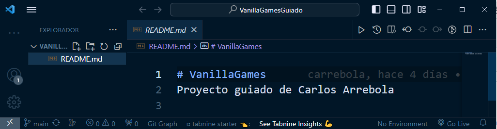
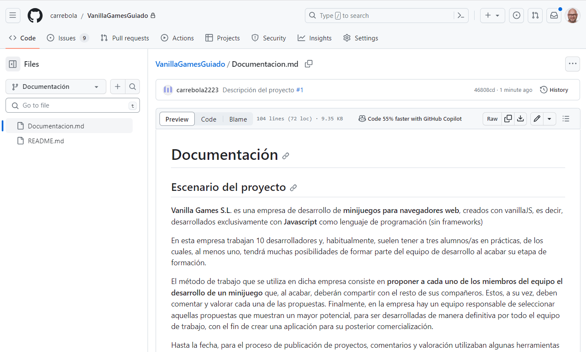
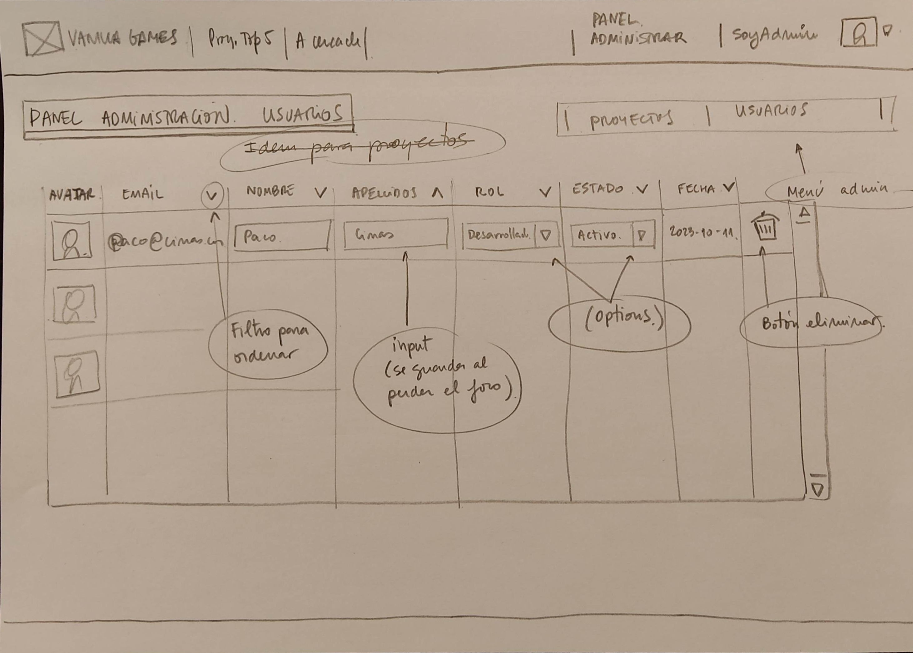

# Definiendo el proyecto 'Vanilla Games'

## Escenario del proyecto

Vanilla Games S.L. es una empresa de desarrollo de minijuegos para navegadores web, creados con vanillaJS, es decir, desarrollados exclusivamente con Javascript como lenguaje de programación (sin frameworks).

En esta empresa trabajan 10 desarrolladores y, habitualmente, suelen tener a tres alumnos/as en prácticas, de los cuales, al menos uno, tendrá muchas posibilidades de formar parte del equipo de desarrollo al acabar su etapa de formación.

El método de trabajo que se utiliza en dicha empresa consiste en proponer a cada uno de los miembros del equipo el desarrollo de un minijuego que, al acabar, deberán compartir con el resto de sus compañeros. Estos, a su vez, deben comentar y valorar cada una de las propuestas. Finalmente, en la empresa hay un equipo responsable de seleccionar aquellas propuestas que muestran un mayor potencial, para ser desarrolladas de manera definitiva por todo el equipo de trabajo, con el fin de crear una aplicación para su posterior comercialización.

Hasta la fecha, para el proceso de publicación de proyectos, comentarios y valoración utilizaban algunas herramientas ofimáticas, tipo hoja de cálculo de google. Actualmente pretenden crear una aplicación web tipo intranet para llevar a cabo este propósito.

Como alumno en prácticas, tu trabajo consiste en crear una aplicación web que permitirá a los desarrolladores de Vanilla Games, publicar sus propuestas de minijuegos, de manera que el resto de compañeros podrá hacer comentarios y emitir una valoración de cada proyecto publicado en esta plataforma.

## Requisitos del proyecto y casos de uso general

Los casos de uso son una técnica de modelado utilizada en el desarrollo de software para describir las interacciones entre un sistema y sus usuarios. En términos simples, los casos de uso describen cómo los usuarios interactúan con un sistema y qué resultados esperan obtener de él.

## Casos de uso general

Esta aplicación web debe permitir a un usuario registrarse (con su nombre, apellidos, email y contraseña) y posteriormente iniciar y cerrar sesión. Un usuario registrado debe poder ver un listado de proyectos publicados por los desarrolladores. También podrá editar su perfil y subir una imagen de tipo avatar.

Si el usuario registrado tiene el perfil de ‘desarrollador’ , además, debe poder publicar proyectos con información del tipo: nombre de proyecto, una descripción, una imagen representativa y dos enlaces, el del proyecto desplegado en un servidor de pruebas y el del repositorio del código correspondiente, el estado del proyecto, etc. También debe poder eliminar o editar sus proyectos.

Por otro lado, el perfil desarrollador debería poder realizar comentarios de cada uno de los proyectos publicados y añadir una valoración en forma de estrellas.

Finalmente, habrá un administrador que podrá adminstrar el perfil de cada uno de los usuarios registrados en la plataforma (editar, borrar, etc) así como modificar el rol de cada uno de estos. También tendrá control total sobre los comentarios y valoraciones.

## Fases de desarrollo

Necesitamos organizarnos un poco. Vamos a planificar como vamos a llevar a cabo las diferentes fases para cumplir con nuestros objetivos:

Definición del proyecto y requisitos básicos: En primer lugar debemos tener muy claro qué se espera de nuestra aplicación, por lo que anotaremos cada funcionalidad teniendo en cuanta los diferentes actores (roles de acceso). Esto es lo hemos hecho en el apartado anterior.
Definición de las versiones: Una vez conocemos los requisitos del proyecto, dividiremos el trabajo en diferentes versiones, de manera que todas ellas serán operativas, aunque cada una ampliando las funcionalidades.
Planificación del proyecto: Basandonos en la metodología Agile devidiremos todo el proceso en diferentes historias/tareas (para cada una de las versiones definidas) que: agruparemos, temporizaremos y representaremos mediante diagramas.
Diseño de la interficie: Basandonos en el diseño centrado en el usuario (DCU):
Realizaremos un Benchmarking (para copiarnos de la competencia)
Crearemos un modelo de usuarios
Diseñaremos los prototipos de bajo nivel(bocetos, wireframes)
Diseñaremos el mockup (prototipo de alto nivel) junto a la guía de estilos (usaremos la aplicación Figma)
Haremos pruebas de usabilidad y rediseñaremos los prototipos.
Programación del frontend (html/css/js):Maquetaremos los prototipos (html/css) y diseñaremos la lógica de validación de cliente
Programación del backend: Utilizaremos un backend como servicio (SUPABASE) para:
Crear las bases de datos
Diseñar consultas sql y funciones postgres
Programaremos un ORM en javascript para el mapping de la bd.
Integración de frontend y backend en la aplicación:
Programaremos la SPA a partir de los prototipos
Programaremos la lógica de acceso a la bd empleando el ORM
Programaremos el resto de funcionalidades (sesiones y roles de acceso, etc)
Analisis usabilidad II: Haremos pruebas de usabilidad (test de usuarios) y solucionaremos los posibles conflictos detectados.
Testing y despliegue en producción:
Diseñaremos un sistema de testing para crear tests unitarios
Configuraremos un entorno DevOps para trabajar con Integración continua y despliegue continuo (CI/CD)
Desplegaremos en producción cada una de las versiones.

# Stack tecnológico

# Metodología Agile. Conceptos

## ¿Qué son las metodología Agile?

Agile es un enfoque de desarrollo de proyectos que se basa en la flexibilidad, la colaboración y la entrega incremental de software.

Este enfoque se utiliza para planificar y gestionar proyectos de manera que puedan adaptarse a los cambios en los requisitos del cliente y a las condiciones cambiantes del mercado.

## Terminología

Os explico la terminología 'Agile' y cómo se usa en la planificación del desarrollo de proyectos en sus diferentes versiones:

User Stories (Historias de Usuario): Las historias de usuario son descripciones breves y centradas en el usuario de las funcionalidades o características que se deben desarrollar. Están escritas en lenguaje natural y se utilizan para representar los requisitos desde la perspectiva del usuario.

Product Backlog (Lista de Producto): Es una lista priorizada de todas las historias de usuario y características que se desean incluir en el producto. El backlog se actualiza y reordena de forma continua a medida que se obtiene más información o cambian las prioridades.

Sprints: Un sprint es un período de tiempo fijo y corto (generalmente de 2 a 4 semanas) durante el cual se trabaja en un conjunto específico de historias de usuario del backlog. Los sprints permiten una entrega incremental y regular de funcionalidades.

Sprint Planning (Planificación de Sprint): En la planificación de sprint, el equipo selecciona las historias de usuario del backlog que se abordarán en el próximo sprint. Esto implica estimar la complejidad y el esfuerzo necesario para cada historia y comprometerse con un conjunto de trabajo para el sprint.

Daily Standup (Reunión Diaria): También conocida como la reunión de scrum, es una breve reunión diaria en la que el equipo se pone al día sobre lo que ha hecho, lo que planea hacer y si hay obstáculos en su camino. Esto fomenta la comunicación y la colaboración.

Sprint Review (Revisión de Sprint): Al final de cada sprint, se realiza una revisión para demostrar las funcionalidades desarrolladas y obtener retroalimentación del cliente o del equipo de stakeholders. Esto ayuda a ajustar las prioridades del backlog.

Sprint Retrospective (Retrospectiva de Sprint): Después de la revisión de sprint, el equipo realiza una retrospectiva para analizar lo que funcionó bien y lo que se puede mejorar en el proceso. Esto facilita la adaptación continua y la mejora.

Burndown Chart (Gráfico de Burn-Down): Es una representación visual del trabajo restante en el sprint. Muestra cómo el equipo está progresando hacia la finalización de las tareas planificadas para el sprint.

Velocity (Velocidad): La velocidad es una medida de la cantidad de trabajo que un equipo puede completar en un sprint. Se utiliza para estimar cuántas historias de usuario se pueden abordar en futuros sprints.

En cuanto a las diferentes versiones de Agile, existen varios marcos y metodologías, como Scrum, Kanban, Lean, eXtreme Programming (XP) y más. Cada uno tiene sus propias prácticas y enfoques, pero todos comparten el valor fundamental de la flexibilidad y la adaptación continua en el desarrollo de software.

La elección de la metodología Agile adecuada depende de las necesidades específicas del proyecto y del equipo de desarrollo. Cada uno de estos enfoques se adapta a diferentes contextos y preferencias organizativas.

## SCRUM

# Requesitos y diagrama de casos de uso

En la introducción de esta documentación, en la sección El proyecto Vanilla Games, en concreto en el apartado Requisitos del proyecto y casos de uso general, hemos definido qué se espera de nuestra aplicación web, a partir de los 'Casos de uso general'.

También hemos dividido todo el trabajo de desarrollo en diferentes versiones, con la intención de que nuestro proyecto esté operativo desde el inicio de su implementación, de manera que conforme evolucione a posteriores versiones, aumentaremos su nivel de funcionalidad.

## Casos de uso para la V1.0 - Definición básica

Registrar usuario: Un usuario puede registrarse en la plataforma proporcionando su nombre, apellidos, email y contraseña.
Recuperar contraseña: Un usuario registrado puede solicitar la recuperación de su contraseña en caso de que la haya olvidado. Para ello, se le enviará un correo electrónico con las instrucciones para restablecer su contraseña.
Iniciar sesión: Un usuario registrado puede iniciar sesión en la plataforma proporcionando su email y contraseña.
Cerrar sesión: Un usuario puede cerrar su sesión en la plataforma en cualquier momento.
Editar perfil: Un usuario registrado puede editar su perfil, actualizando su nombre, apellidos, email o contraseña.
Ver proyectos: Un usuario registrado puede ver un listado de proyectos publicados por los desarrolladores.
Publicar proyecto: Un usuario con el perfil de desarrollador puede publicar un proyecto proporcionando información como nombre, descripción, imagen representativa, enlaces a servidor de pruebas y repositorio de código, estado del proyecto, etc.
Editar proyecto: Un usuario con el perfil de desarrollador puede editar un proyecto que haya publicado previamente, actualizando la información del proyecto.
Eliminar proyecto: Un usuario con el perfil de desarrollador puede eliminar un proyecto que haya publicado previamente.
Ver/Editar usuarios: Un adminsrador puede ver una tabla con todos los usuarios que hay registrados y editar la información, incluido el ROL de usuario.
Eliminar usuario: Un administrador puede eliminar cualquier usuario registrado en la plataforma.

# Diagrama de casos de uso

## Diagrma de casos de uso para la versión 1.0

Este diagrama refleja de forma resumida qué acciones se pueden llevar a cabo en nuestro aplicación dependiendo del rol del usuario.

Ahora que tenemos claro todo lo que debe hacer la versión 1.0, nuestra misión ahora es planificar el trabajo que se nos viene encima...

# PLANIFICACIÓN DEL PROYECTO

## Planificación del proyecto

¡Estamos listos y hemos comenzado a desarrollar la versión 1.0 de nuestro proyecto!

En el apartado anterior hemos definido qué funcionalidades debe tener. Además, hemos analizado las diferentes arquitecturas y tecnologías y hemos optado por utilizar una CSR (Client Side Rendering basada en una SPA programada en Javascript y conectada a Supabase como servicio backend).

Por lo tanto estamos en condiciones de definir cada una de las tareas que necesitaremos realizar para llevar a cabo esta primera versión del proyecto.

Para poder planificar el trabajo, vamos a crear el 'backlog de proyecto', es decir, vamos a desglosar el trabajo en historias para, a continuación, crear el backlog de sprint (donde agruparemos las historias por entregas). Finalmente vamos a planificar su temporización, es decir, vamos a asignar un tiempo determinado a cada historia.

## SPRINT 0: Definición del proyecto

Historia: Requisitos, casos de uso y diagrama de casos de uso Como desarrollador, quiero definir de manera genérica las especificaciones de la aplicación.

Historia: Versiones y planificación Como desarrollador, quiero agrupar las especificaciones en versiones, definir las tareas necesarias y realizar la planificación de todo el proceso de desarrollo del proyecto.

Historia: Casos de uso especificos y diagramas de flujo Como desarrollador quiero definir las especificaciones y casos de uso para la versión 1.0.

(Esta historia ya hemos comenzado a trabajarla en apartados anteriores. No obstante, es importante que quede constancia de ello para poder hacer una valoración del tiempo total invertido.)

## SPRINT 1: Diseño de la interficie

Historia: Bocetos: Como diseñador quiero dibujar los bocetos de todas las posibles pantallas del proyecto y testear su funcionamiento.
Historia: Wireframes, Mockup y guía de estilos: Como diseñador quiero dibujar los mockups y crear la guía de estilos a partir de los colores, tipografías, etc seleccionadas.

## SPRINT 2: Prototipos

Historia: Entorno de desarrollo: Como diseñador/programador quiero instalar y configurar las herramientas necesarias para programar la aplicación, trabajar con repositorios y crear un entorno integración continua y despliegue continuo.
Historia: Prototipos html: Como maquetador web quiero crear las páginas html del proyecto a partir de los wireframes aplicando la guía de estilos y utilizando Bootstrap 5.
Historia: Validaciones de formularios: Como programador quiero definir e implementar las validaciones de los formularios del proyecto.

## Sprint 3: Implementación de la SPA

Historia: Entorno de desarrollo basado en NodeJS: Como programador quiero instalar y configurar todas las herramientas necesarias (NodeJS, Vite, etc.) para el desarrollo de una app tipo SPA basada en Javascript
Historia: Creación de proyecto basado en SPA y organización de archivos para las vistas basadas en módulos js: Como programador quiero configurar el sistema de carpetas para las vistas y crear los archivos a partir de componentes html basados en los prototipos.
Historia: Creación de componentes: Como programador quiero crear los componentes para el encabezado, el enrutado de las páginas y los menús.
Historia: Diseño del aspecto de las vistas: Como usuario quiero poder navegar por todas las vistas de la aplicación (independientemente del del rol).
Historia: Implementación de la lógica para la validación de los formularios: Como usuario quiero recibir feedback de validación en las vistas con formularios.
Historia: Lógica para la autenticación de usuarios: Como usuario registrado quiero poder recordar los datos de sesión al loguearme (Uso de localStorage)
Historia: Actualización de componentes header y menús en función del rol de usuario logueado: Como usuario logueado quiero poder navegar por las vistas de la aplicación. (Podrán verse solo las opciones que corresponden a mi rol).
Historia: Diseño de las vistas a partir de los datos de un archivo JSON: Como programador quiero simular el registro, login y visualización de las tablas de usuarios y proyectos a partir de datos ficticios obtenidos de una archivo json de prueba.
Historia: Lógica para la administración de usuarios y proyectos (ver, editar, borrar, etc.): Como administrador quiero poder gestionar los usuarios y proyectos (CRUD)

## Sprint 4: Backend

Historia: Diseño de la base de datos: Como programador quiero diseñar la base de datos en base a diagrama UML (diagrama entidad-relación)

Historia: Implementación de las tablas y funciones en supabase: Como programador quiero implementar las bases de datos en Supabase, diseñar las consultas e implementar las funciones postgree multitabla

Historia: API javascript de Supabase: Como programador quiero probar las apis de javascript para el acceso a la base de datos

Historia: Implementación de un ORM para mapping de la base de datos: Como programador quiero diseñar el diagrama de clases e implementarlo en javascript para tener un mapping de la bd.

## Sprint 5: Integración del frontend y el backend

Historia: Login y registro: Como usuario quiero poder registrarme e iniciar sesión.

Historia: Gestión de sesiones: Como usuario registrado quiero ver la web en base al rol que tengo asignado.

Historia: Editar perfil Como usuario registrado quiero poder ver y modificar mi perfil.

Historia: Gestión de Proyectos (Vista proyectos, detalle proyecto, etc): Como usuario registrado 'desarrollador' quiero poder ver los proyectos, ver mis proyectos, crear proyectos, ver detalle de los proyectos y editar y borrar mis proyectos.

Historia: Gestión de usuarios: Como usuario registrado 'administrador' quiero poder ver, editar y borrar los usuarios del sistema.

## Sprint 6: Revisión y despliegue en producción de la versión 1.0

Historia: Test de usuarios Como diseñador quiero realizar tests de usuarios a un grupo de usuarios focales.

Historia: Revisión de la aplicación Como programador quiero revisar y corregir los posibles problemas detectados en el test de usuarios.

Historia: Despliegue en producción Como programador quiero despleguar la aplicación en producción.

Ahora que tenemos las historias definidas es el momento de planificar el trabajo. Para ello necesitamos una herramienta que nos permita gestionar y temporizar cada una de las tareas. Nosotros utilizaremos GitHub Projects

# Documentación en repositorio

Ya tenemos nuestro proyecto planificado en un primer nivel.

Las tres primeras versiones hacen referencia a definición de los requisitos, casos de uso y versiones así como a la planificación.

Vamos a dar un paso atrás para recuperar la documentación generada en estas historias y almacenarla en el repositorio.

Para ello, vamos a comenzar creando una nueva rama en nuestro repositorio:

Ahora abrimos el repositorio con VSCode para trabajar de manera más cómoda. Para ello:

Abrimos una ventana de VSCode
Hacemos click en clonar repositorio y copiamos en la ventana superior la url del repositorio de 'VanillaGames' y hacemos click en 'Clonar repositorio'
Indicamos donde queremos que aparezca la carpeta de nuestro proyecto (en mi caso en el escritorio)
Observa como podemos ver en la columna izquierda la raiz del proyecto con el archivo README.md.

Si te fijas, podrás ver en la parte inferior izquierda, el nombre de la rama actual ('main'). Haz click sobre el nombre de la rama y selecciona la rama 'Documentación' que acabamos de crear.

## Documentando el proyecto en el repositori

Vamos a comenzar a subir archivos a nuestro repositorio. En nuestro caso utilizaremos archivos con extensión md para poder usar Markup. De esta manera podremos visualizar toda la información desde el mismo GitHub.

Asegurate que estás en la rama 'Documentación'
Crea un archivo con nombre DOCUMENTACION.md
Copia la documentación que hemos generado hasta ahora (la encontrarás en el apartado 'Definiendo Vanilla Games' )

Ahora, para subir los cambios en el repositorio, solo tienes que hacer click en el tercer icono de vscode (verás que tiene un 1 indicando que hay cambios en un archivo) y añadir un mensaje para el commit.

Después de hacer el commit te preguntará si quieres hacer 'push'. Haz click en el bóton para hacerlo.

Si vas ahora a GitHub y seleccionas la rama podrás ver los cambios.

Abre los Issues del repositorio y podrás ver en el primer Issue con #1 como aparece información referente a este último push

# Casos de uso específicos y diagramas de flujo

En el primer apartado 'Requisitos y diagrama de casos de uso' para esta versión 1.0, hemos definido de manera general los casos de uso que se contemplan para cada actor y los hemos reflejado en un diagrama de casos de uso.

Es el momento de ser más concretos y detenernos a reflexionar en cada uno de los procesos que se realizarán para cada tarea, incluyendo los posibles errores cometidos por el usuario o el propio sistema.

## Casos de uso específicos

## 1. Registrar usuario

Actores: Usuario no registrado.

Precondiciones: El usuario no ha iniciado sesión.

Flujo básico:

El usuario navega a la página de registro.
El usuario introduce su nombre, apellidos, email y contraseña.
El sistema valida que los campos estén completos y que el email no esté registrado previamente.
El sistema crea un nuevo usuario con los datos proporcionados.
El sistema muestra un mensaje de confirmación y redirige al usuario a la página de inicio.
Flujos alternativos:

3a. El sistema detecta que el email ya está registrado: muestra un mensaje de error y no crea la cuenta.

## 2. Recuperar contraseña

Actores: Usuario registrado.

Precondiciones: El usuario no ha iniciado sesión.

Flujo básico:

El usuario navega a la página de registro.
El usuario selecciona la opción 'Recuperar contraseña'
El sistema valida que el campo 'email' esté completo y que el email esté registrado previamente.
El sistema muestra un mensaje de confirmación de envio del mail para la recuperación de contraseña y redirige al usuario a la página de inicio.
Flujos alternativos:

3a. El sistema detecta que el email no está registrado: muestra un mensaje de error y no envia el mail.

## 3. Iniciar sesión

Actores: Usuario registrado.

Precondiciones: El usuario no ha iniciado sesión.

Flujo básico:

El usuario navega a la página de inicio de sesión.
El usuario introduce su email y contraseña.
El sistema valida las credenciales y crea una sesión para el usuario.
El sistema redirige al usuario a la página principal de la aplicación.
Flujos alternativos:

3a. Las credenciales son incorrectas: el sistema muestra un mensaje de error y no crea la sesión.

## 4. Cerrar sesión

Actores: Usuario registrado.

Precondiciones: El usuario ha iniciado sesión.

Flujo básico:

El usuario hace clic en el botón de "cerrar sesión".
El sistema cierra la sesión del usuario.
El sistema redirige al usuario a la página de inicio.

## 4. Ver/Editar perfil

Actores: Usuario registrado.

Precondiciones: El usuario ha iniciado sesión.

Flujo básico:

El usuario navega a la página de edición de perfil.
El usuario edita su nombre, apellidos y contraseña.
El sistema valida los campos y actualiza el perfil del usuario.
El sistema muestra un mensaje de confirmación.
Flujos alternativos:

3a. El usuario intenta cambiar su email: el sistema valida que el email no esté registrado previamente.

## 5. Ver proyectos

Actores: Usuario registrado.

Precondiciones: El usuario ha iniciado sesión.

Flujo básico:

El usuario navega a la página de proyectos.
El sistema muestra una lista de proyectos publicados por desarrolladores.
El usuario puede hacer clic en un proyecto para ver más detalles.
El usuario puede mostrar/filtrar los proyectos a partir de un buscador

## 6. Publicar proyecto

Actores: Usuario registrado con perfil de desarrollador.

Precondiciones: El usuario ha iniciado sesión y su perfil es de desarrollador.

Flujo básico:

El usuario navega a la página de publicación de proyecto.
El usuario introduce el nombre, descripción, imagen representativa, enlaces de servidor y repositorio, estado y otra información relevante del proyecto.
El sistema valida los campos y crea un nuevo proyecto.
El sistema muestra un mensaje de confirmación y redirige al usuario a la página de proyectos.
Flujos alternativos:

2a. El desarrollador decide no publicar el proyecto y selecciona la opción de cancelar.
El sistema descarta la información ingresada en el formulario.
El sistema muestra un mensaje de confirmación al desarrollador.

## 7. Editar proyecto:

Actor principal: Desarrollador

Objetivo: Editar la información de un proyecto previamente creado.

Precondiciones: El usuario debe haber iniciado sesión como desarrollador y tener al menos un proyecto previamente creado.

Flujo principal:

El usuario selecciona la opción de "Editar proyecto".
El sistema muestra la lista de proyectos previamente creados por el usuario.
El usuario selecciona el proyecto que desea editar.
El sistema muestra el formulario de edición del proyecto con la información actual del mismo.
El usuario realiza los cambios necesarios en la información del proyecto y guarda los cambios.
El sistema valida la información ingresada por el usuario y actualiza la información del proyecto en la base de datos.
El sistema muestra una confirmación de que la información del proyecto ha sido actualizada correctamente.

## 8. Eliminar proyecto:

Actor principal: Desarrollador

Objetivo: Eliminar un proyecto previamente creado.

Precondiciones: El usuario debe haber iniciado sesión como desarrollador y tener al menos un proyecto previamente creado.

Flujo principal:

El usuario selecciona la opción de "Eliminar proyecto" del proyecto que desea eliminar.
El sistema muestra una confirmación de que el usuario está seguro de eliminar el proyecto seleccionado.
El usuario confirma que desea eliminar el proyecto.
El sistema elimina el proyecto de la base de datos y muestra una confirmación de que el proyecto ha sido eliminado correctamente.
El sistema actualiza la información de proyectos.

## 9. Ver/Editar usuario:

Actor principal: Usuario administrador

Objetivo: Editar la información de los usuarios registrados.

Precondiciones: El usuario debe haber iniciado sesión en la aplicación y tener rol administrador.

Flujo principal:

El usuario selecciona la opción de "Ver usuarios".
El sistema muestra una tabla con 'inputs' con los datos de los usuarios.
El administrador realiza los cambios necesarios en la información de los usuarios (incluido el rol y el estado) y guarda los cambios.
El sistema valida la información ingresada por el usuario y actualiza la información del usuario en la base de datos.
El sistema muestra una confirmación de que la información del perfil ha sido actualizada correctamente.

## 9. Eliminar usuario:

Actor principal: Usuario administrador

Objetivo: Eliminar usuario del sistema.

Precondiciones: El usuario debe haber iniciado sesión en la aplicación y debe tener rol administrador.

Flujo principal:

El usuario selecciona la opción de "Ver usuarios".
El sistema muestra una tabla con 'inputs' con los datos de los usuarios.
El administrador hace clic sobre el icono de eliminar usuario de la fila correspondiente.
El sistema informa de que se eliminarán todos sus registros.
El sistema muestra una confirmación de que la información de que el usuario ha sido borrado correctamente.

# Errores

Vamos a repasar los diferentes casos de uso analizando el flujo principal y añadiendo los flujos alternativos para contemplar los posibles errores del sistema. Puedes considerar los siguientes mensajes:

Error de conexión: El servidor no puede establecer una conexión con la base de datos, lo que impide que se puedan realizar operaciones en la plataforma. El sistema debería mostrar un mensaje de error indicando que no se pudo conectar con la base de datos y ofrecer la posibilidad de volver a intentarlo o contactar con el soporte técnico.

Error de validación: Cuando el sistema recibe información del usuario, debe validarla para asegurarse de que cumple con los requisitos de formato y contenido necesarios. Si la información no es válida, el sistema debería mostrar un mensaje de error indicando el problema específico, como "El campo de correo electrónico debe ser una dirección de correo válida".

Error de autenticación: Si un usuario intenta acceder a una página o realizar una acción que requiere autenticación, pero no ha iniciado sesión o sus credenciales son incorrectas, el sistema debería mostrar un mensaje de error indicando que la acción no está autorizada y ofrecer la posibilidad de iniciar sesión o recuperar la contraseña.

Error de autorización: Si un usuario intenta realizar una acción que no está autorizada para realizar debido a su rol, el sistema debería mostrar un mensaje de error indicando que la acción no está autorizada y ofrecer la posibilidad de volver a la página anterior.

Error de servidor: En caso de que se produzca un error interno en el servidor, como una excepción no controlada, el sistema debería mostrar un mensaje de error genérico indicando que 
se produjo un error y ofrecer la posibilidad de volver a intentarlo o contactar con el soporte técnico.

# Hist3a - Diseño de la interfaz. Bocetos

Una vez tenemos claro las funcionalidades que debe realizar nuestra aplicación, comenzamos con el diseño de la interfaz.

Este proceso incluye diseñar los bocetos, los wireframes y los mockups ,para acabar creando los prototipos con html.

Sin duda, el primer paso, debe ser dibujar los bocetos, así que, busca un lápiz, una goma de borrar y un puñado de papel, ¡y manos a la obra!

## Home y menús usuarios

Hemos didivido la interficie en 3 zonas, el encabezado (header), el cuerpo principal (main) y el pie de página (footer).

En el header vamos a alojar una barra superior fija con: el logo y nombre de la web (que hará las veces de link a la página principal), un menú central genérico (para acceder a páginas públicas), un menú central específico (que será diferente en función del rol de usuario logueado), y un icono (avatar) que permitirá ver la imagen del usuario logueado y que hará de botón para desplegar otro menú, el menú de usuario (que tendrá diferentes items dependiendo de si la sesió está abierta o no y del tipo de rol que tenga el usuario logueado).
El cuerpo (main) albergará el contenido de las páginas. Será la sección que vaya cambiando dependiendo de la página que carguemos. En la página home simplemente aparece una imagen de fondo y el nombre de la web.
El header será meramente informativo.

## Registro de un usuario

## Iniciar sesión

## Editar mi perfil

Editar perfil será una ventana modal, es decir, se mostrará la ventana y el fondo se volverá oscuro.

Esta ventana de edición permitirá, además de modificar los datos del usuario, añadir una imagen de avatar. Por el momento, en esta primera versión, podremos añadir el link de una imagen que esté alojada en un servidor. En la siguiente versión (versión 1.1) actualizaremos esta ventana para que puedan subirse archivos (imágenes) al servidor.

## Listado de todos los proyectos

En esta página podemos ver, en la pestaña izquierda, todos los proyectos en forma de tabla. La pestaña derecha mostrará solo los proyectos que ha subido el usuario que ha iniciado la sesión.

Al hacer clic en cualquier parte de la fila se accede al detalle del proyecto.

También tenemos un buscador que permite buscar proyectos por palabras clave en el nombre o descripción.

Las celdas de encabezado de las tablas incluyen un icono (flecha hacia arriba o hacia abajo) que permitirá ordenar la tabla por la columna en concreto.

## Listado de Mis proyectos

En esta pestaña podemos ver los trabajos pertenecientes al usuario logueado. En cada fila aparece, además, un icono para editar y borrar el proyecto correspondiente. Por otro lado tenemos la opción de subir un nuevo proyecto.

Habría que valorar si es mejor crear un único buscador para el nombre y descripción del proyecto o dos barras de busqueda, una para cada sección, tal y como se muestra en el boceto anterior.

## Detalle de un proyecto

Si el usuario que está viendo la información de un proyecto en concreto es el autor de dicho proyecto, aparecerá un icono para la edición del mismo.

##  Nuevo proyecto / Editar un proyecto

Esta vista sirve tanto para crear un nuevo proyecto como para editarlo.

Si el proyecto es nuevo, el botón mostrará el texto ENVIAR, pero si estamos editándolo aparecerá el texto ACTUALIZAR. Al crear o actualizar el proyecto, la web nos reenvía a la vista 'Detalle de proyecto'.

## Panel administración de proyectos

Si tienes el rol 'administrador' aparecerá el item 'Panel administración' en el menú superior específico. Este item nos permite cargar la vista 'Panel administración de proyectos'. Desde esta vista también podemos acceder al 'Panel administración de usuarios'.

Esta vista permite editar o borrar cualquier proyecto haciendo click en los iconos correspondientes. La opción editar nos llevará a la vista 'Editar proyecto'

## Panel administración de usuarios

Esta vista permite editar los datos de los usuarios. Por supuesto es solo accesible para los administradores.

En esta vista, el método para editar la información es diferentes. Aquí los datos aparecen sobre 'inputs', de manera que al hacer clic sobre ellos, aparecerá el cursor de edición. Se pueden modificar todos los datos (en especial el 'estado' y el 'rol' del usuario) excepto el email.

# Hist3b - Test de usuarios inicial

## Primer Test de Usabilidad

Tal y como hemos comentado en el apartado 'Diseño centrado en el usuario', una de las premisas de esta metodología consiste en realizar evaluaciones constantes para detectar los posibles problemas de usabilidad cuanto antes mejor. Por lo que una buena idea es realizar un primer test de usabilidad.

Por el momento os adelanto que la técnica más utilizada par evaluar la usabilidad son los 'tests de usuario'.

Estos consisten en crear una bateria de acciones que el usuario debe realizar, para detectar si existe algún problema en la interación con la aplicación. A continuación vamos pidiendo a un usuario focal (una persona que esté dentro del target de usuarios a quien va dirigida la app) que realice cada tarea, mostrandole los bocetos que aparecerán en cada interacción. Por ejemplo, si hace clic sobre el item de menú 'login' le mostraremos el boceto de la página 'login'.

Para este primer test hemos preparado las siguientes acciones:

Suponiendo que eres un usuario no registrado:

Accede a la información general 'A cerca de' de esta web.
Regístrate.
Logueate.
Modifica tu perfil añadiendo una imagen de avatar.
Busca un proyecto llamado 'Tetris'.
Accede al detalle de este proyecto.
Cierra sesión.
Suponiendo que eres un usuario con rol 'Desarrollador':

Crea un proyecto nuevo.
Accede a la lista de tus proyectos.
Muestra el detalle de tu nuevo proyecto.
Edita tu proyecto cambiando la descripción.
Borra tu proyecto.
Suponiendo que eres un usuario con rol 'Administrador':

Muestra la lista de proyectos.
Borra un proyecto.
Modifica el nombre de un proyecto.
Muestra la listra de todos los usuarios registrados.
Canvia el rol de uno de ellos.
Modifica la imagen de su avatar.

## Conclusiones y modificaciones

De este primer test de usuario se desprenden las siguientes conclusiones:

La vista de proyectos en forma de tabla no es muy atractiva.
El usuario ha tenido dificultades a la hora de intentar modificar la imagen avatar de un usuario.
Para mejorar estos pequeños problemas de usabilidad vamos a tomar las siguientes acciones:

En la vista de proyectos vamos crear un par de botones para poder alternar entre ver los proyectos en forma de tabla o en forma de tarjetas.
En la vista de administración de usuarios, añadir un pequeño icono (un lápiz) sobre la imagen del avatar del usuario para que se intuya que, al hacer clic sobre la imagen, se accede a la ventana de modificación de perfil.
Estos serían los bocetos actualizados:

## Vista de proyectos

Poner la imagen del los nuevos bocetos

## Vista del Panel de administraición de usuarios

Poner la imagen del los nuevos bocetos

Ahora que tenemos los bocetos creados y testeados, es el momento de pasar al siguiente nivel: El diseño de los wireframes.

# Hist4 - Wireframe, mockup y guía de estilos

En el apartado anterior hemos diseñado y testeado los bocetos para la versión 1.0 de nuestro proyecto.

El siguiente paso, si nos basamos en el DCU (Diseño centrado en el usuario), sería diseñar los wireframes y, una vez tenemos los wireframes, los mockups junto a la guía de estilos.

Un proyecto de mayor envergadura requeriría de un equipo de trabajo con más de un perfil. La tarea de diseñar la interficie corresponde, por un lado, al arquitecto de la información y por otro, a un diseñador gráfico.

## Y nosotros, ¿necesitamos wireframe? ¿y mockup? ¿y guía de estilos?

En nuestro caso, como el proyecto es muy básico, no nos vamos a centrar en aquellas tareas que corresponderían a un arquitecto de la información ni a un diseñador gráfico.

El mapa web de nuestra aplicación se limita a dar acceso a los proyectos y la administración de los usuarios. Sería tan sencillo com este:

En cuanto al diseño gráfico, aunque es una misión emocionante, nos vamos a limitar a trabajar con un tema de bootstrap utilizando Bootswatch, respetando, a priori, su paleta de colores y modificando, solo en algunos casos, algunos detalles como la fuente para los títulos.

